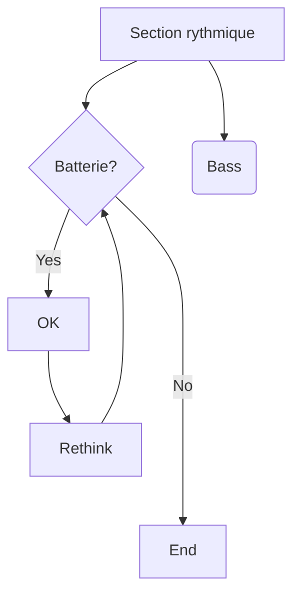

# TCD_test

Ici, on crée un petit projet qui permet de générer des tableaux croisés à partir des données du recensement

## Exactement, comment fait-on ?

Alors, c'est très simple

- prendre le ficheir
- le regrouper avec data.table
- faire le fichier dans le dossier output

